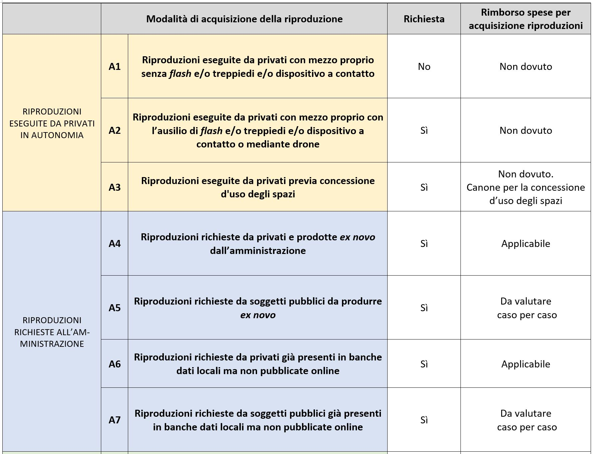
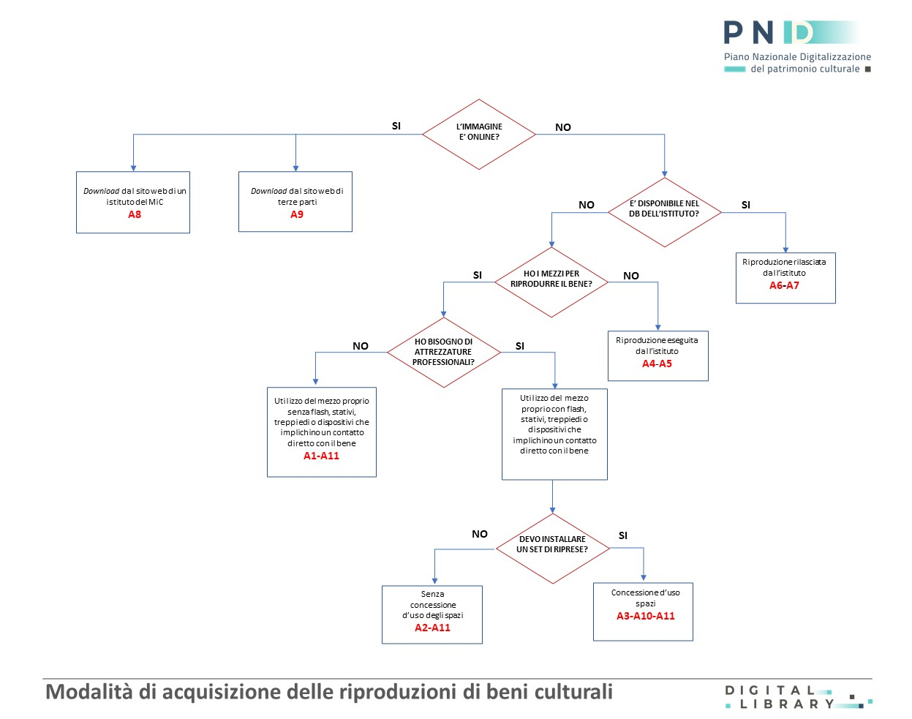

.. _modalita_di_acquisizione_delle_riproduzioni:

Modalità di acquisizione delle riproduzioni
===========================================

Nel presente paragrafo sono descritti undici canali principali di
acquisizione delle mere riproduzioni di beni culturali pubblici in
pubblico dominio (**A1**-**A11**), a loro volta distinti in quattro
macrocategorie: “riproduzioni eseguite da privati in autonomia”,
“riproduzioni richieste all’amministrazione”, “riproduzioni esistenti
acquisite online” e “altre forme di acquisizione”.

Gli undici canali di acquisizione si trovano infine rappresentati
graficamente nel quadro sinottico e nel diagramma di flusso riportato in
fondo al presente paragrafo.

.. _A1:

A1. Riproduzioni eseguite da privati con mezzo proprio senza *flash* e/o treppiedi e/o dispositivo a contatto
-------------------------------------------------------------------------------------------------------------

Ai sensi dell’art. 108, comma 3 del Codice dei beni culturali è libera
la riproduzione di un bene culturale effettuata direttamente
dall’utente, nel rispetto del diritto d’autore e delle norme sulla
riservatezza, a condizione che non si faccia uso di strumenti che
comportino un contatto diretto con il supporto da riprodurre (come ad
esempio scanner) o di *flash*, treppiedi o stativi che potrebbero
mettere a rischio l’integrità fisica del bene culturale oggetto di
riproduzione. L’utilizzo di tali dispositivi tecnici quindi non è
libero, dovendo essere autorizzato preventivamente dall’ente che ha in
consegna il bene il quale, in caso di assenso, detterà le relative
prescrizioni a tutela del bene da riprodurre (cfr. :ref:`A2`).

**Esempio:** *l’utente si serve della propria fotocamera o* smartphone
*senza ricorrere a flash, treppiedi o stativi per riprodurre un
monumento, un’opera museale, un documento d’archivio o un’opera
conservata in biblioteca. In questi casi può farlo gratuitamente e senza
dover richiedere alcuna autorizzazione.*

.. _A2:

A2. Riproduzioni eseguite da privati con mezzo proprio con l’ausilio di *flash* e/o treppiedi e/o dispositivo a contatto o mediante drone
-----------------------------------------------------------------------------------------------------------------------------------------

Le riprese professionali che implicano l’impiego di *flash*, treppiedi o
qualsiasi strumento che possa comportare un contatto diretto con il bene
culturale sono soggette ad autorizzazione da parte dell’ente pubblico
che ha in consegna il bene oggetto di riproduzione. Qualora l’uso di
tale strumentazione comporti un’occupazione significativa degli spazi
interni al luogo della cultura, tale da condizionarne la fruizione da
parte del pubblico, può essere richiesto un canone di concessione legato
all'uso temporaneo degli spazi (cfr. :ref:`A3`). Per quanto riguarda le
riproduzioni effettuate attraverso drone, si rimanda alla specifica
normativa di settore [1]_.

**Esempio:** *l’utente ha necessità di servirsi di dispositivi e
attrezzature specifiche, quali* flash e *treppiedi per garantire
un’ottima qualità alla riproduzione che desidera effettuare all’interno
di un luogo della cultura (museo, biblioteca, archivio, parco o area
archeologica). In questi casi egli dovrà richiedere un’autorizzazione
specifica all’istituto che ha in consegna il bene da riprodurre.*

.. _A3:

A3. Riproduzioni eseguite da privati previa concessione d'uso degli spazi
-------------------------------------------------------------------------

Le riproduzioni professionali che implicano l’occupazione temporanea di
spazi all’interno di luoghi della cultura per riprese video o
fotografiche sono soggette a specifica richiesta di concessione d’uso
individuale degli spazi, regolata dagli artt. 106 e 108 del Codice dei
beni culturali, a cui si sommano eventuali altri costi, quali rimborsi
spese per aperture prolungate o assicurazioni. L’uso esclusivo di uno
spazio all’interno di istituti e luoghi della cultura pubblici va
autorizzato preventivamente per garantire adeguati livelli di tutela ai
beni culturali nel rispetto delle esigenze minime di fruizione pubblica
dei medesimi spazi; viceversa il canone di concessione si giustifica qui
come forma di risarcimento economico alla collettività per una forma di
utilizzo del bene tipicamente “rivale” ed escludente (cfr. cap. :ref:`principi_riuso`).

**Esempio:** *Un fotografo/regista ha necessità di occupare
temporaneamente con proprie attrezzature che saranno installate dalla
sua* troupe *nella sala espositiva di un istituto culturale per poter
effettuare una campagna di riprese fotografiche/cinematografiche. A
questo scopo egli dovrà inviare all’istituto di riferimento una
richiesta di concessione d’uso degli spazi da occupare per le riprese.*

.. _A4:

A4. Riproduzioni richieste da privati e prodotte *ex novo* dall’amministrazione
-------------------------------------------------------------------------------

Qualora un utente privato avesse necessità di acquisire una riproduzione
di un bene non già disponibile nella banca dati dell’istituto che ha in
consegna il bene, è tenuto a richiedere la riproduzione, che sarà
appositamente realizzata dal servizio di riproduzione interno
all’istituto o da eventuali ditte concessionarie del servizio. In questi
casi la riproduzione, che risponde a una specifica esigenza del singolo
utente, qualora comporti un costo per l’amministrazione può essere
soggetta a rimborso delle spese sostenute, ai sensi dell’art. 108, comma
3 del Codice dei beni culturali, indipendentemente dall’uso successivo
della riproduzione. Il rimborso spese non dovrà essere parametrato sulla
risoluzione della riproduzione, ma sulla complessità della procedura
tecnica di riproduzione. A tal riguardo si sottolinea come sia poco
opportuno consegnare all’utente immagini a bassa risoluzione, in quanto
le immagini cosiddette “degradate” (a bassissima risoluzione) non sono
certo funzionali alla “protezione” del bene culturale; al contrario,
riproduzioni di scarsa qualità contribuiscono al proliferare in rete di
immagini “spazzatura” che non liberano alcun valore culturale mentre, al
contrario, ostacolano la corretta conoscenza del bene culturale stesso
(cfr. par. :ref:`come_pubblicare_le_riproduzioni`).

**Esempio:** *l’utente chiede all’istituto di ottenere una riproduzione
del bene culturale che non è altrimenti riuscito ad acquisire. La
riproduzione del bene non è infatti presente nelle banche dati interne
all’istituto, non è scaricabile dal sito web dell’istituto, oppure
quella individuata non lo soddisfa. L’utente è quindi intenzionato a
chiedere all’istituto di eseguire una riproduzione ex novo del bene
medesimo. In questo caso egli dovrà corrispondere all’istituto (o alla
società/professionista che gestisce il servizio di riproduzione) un
corrispettivo per l’esecuzione e la fornitura della riproduzione.*

.. _A5:

A5. Riproduzioni richieste da soggetti pubblici da produrre *ex novo*
---------------------------------------------------------------------

L’amministrazione titolare del bene può valutare la possibilità di
effettuare gratuitamente riproduzioni *ex novo* di beni culturali
richieste da soggetti pubblici in un’ottica di collaborazione
istituzionale.

**Esempio:** *un’amministrazione comunale chiede a un archivio di Stato
di effettuare gratuitamente copie digitali di alcuni fascicoli
necessarie per realizzare un video destinato a promuovere lo studio
delle fonti archivistiche nelle scuole del comune. L’archivio di Stato,
riconosciuto l’interesse culturale dell’evento e valutata l’entità
dell’impegno in termini di tempo, mezzi e personale, accetta di eseguire
le riproduzioni gratuitamente e ne cura l’invio all’ente richiedente.
L’archivio valuta altresì l’opportunità di procedere alla stipula di una
convenzione o di un protocollo d’intesa* ad hoc.

.. _A6:

A6. Riproduzioni richieste da privati già presenti in banche dati locali ma non pubblicate online
-------------------------------------------------------------------------------------------------

Qualora la riproduzione di un bene sia già presente nella banca dati
dell’ente che ha in consegna il bene stesso, ma non ancora disponibile
online, essa potrà essere consegnata al richiedente dietro pagamento di
un rimborso spese per l’attività di ricerca e messa a disposizione
dell’immagine stessa. Anche in questo caso (cfr. :ref:`A4`) il rimborso
spese non dovrà essere parametrato sulla risoluzione della riproduzione
effettuata ma andrà definito in ragione dei costi amministrativi e
gestionali sostenuti dall’ente per soddisfare la richiesta. Qualora la
richiesta pervenga da un ente privato, l’istituto può valutare la
cessione gratuita delle immagini al richiedente nell’ambito di un
accordo di valorizzazione.

**Esempio:** *le immagini d’interesse per l’utente sono presenti solo
nelle banche dati interne all’istituto, in attesa di essere pubblicate
in rete. L’utente chiede di poterle acquisire comunicando gli estremi
identificativi del bene culturale. L’istituto provvede a individuare il
file digitale nelle proprie banche dati e si occupa dell’invio del file
digitale all’utente, il quale corrisponderà all’istituto una tariffa a
titolo di rimborso spese per l’amministrazione.*

.. _A7:

A7. Riproduzioni richieste da soggetti pubblici già presenti in banche dati locali ma non pubblicate online
-----------------------------------------------------------------------------------------------------------

Qualora la riproduzione di un bene già presente nella banca dati
dell’ente conservatore sia richiesta da un soggetto pubblico, la
riproduzione potrà eventualmente essere fornita senza applicare rimborsi
spese in un’ottica di collaborazione istituzionale.

**Esempio:** *un dipartimento universitario ha intenzione di realizzare
un database epigrafico da pubblicare online nel sito web dell’ateneo.
L’università e il museo elaborano insieme un protocollo d’intesa nel
quale si pattuisce la messa a disposizione gratuita delle riproduzioni
digitali della collezione epigrafica del museo già presenti nel
database* offline *dell’istituto insieme al relativo corredo di metadati
descrittivi previa citazione della provenienza.*

*- Riproduzioni acquisite online -*

.. _A8:

A8. Riproduzioni acquisite da soggetti pubblici o privati dai siti web istituzionali del MiC mediante *download*
----------------------------------------------------------------------------------------------------------------

Qualora la riproduzione sia già stata effettuata dall'istituto nel corso
di una campagna di digitalizzazione e sia stata resa pubblicamente
accessibile online, l'utente potrà acquisire autonomamente l'immagine
senza la mediazione diretta dell'istituto, e quindi senza costi vivi da
rimborsare. Nel caso in cui l’accesso alla riproduzione sia accompagnato
da servizi specifici ad alto valore aggiunto (visite virtuali online,
video-presentazioni di opere, *download* massivo, accesso a contenuti
extra, interrogazioni di banche dati correlate, altissima definizione)
può essere richiesta all’utente una compartecipazione alle spese
sostenute dall’ente per la raccolta e l’organizzazione avanzata dei
contenuti digitali, in armonia con le previsioni della direttiva europea
PSI (cfr. par. :ref:`direttiva_2019_1024`). La scelta dell’istituto di rendere l’immagine non
solo disponibile in rete, ma anche scaricabile (con o senza preventiva
registrazione al sito) va dunque incoraggiata; in ogni caso vanno
esplicitati i termini d’uso delle riproduzioni mediante l’apposizione
dell’etichetta BC Standard (cfr. par. :ref:`licenze_e_termini_d_uso`).

Coerentemente con quanto già rilevato in precedenza (cfr. :ref:`A4`), il
*download* di immagini a bassa risoluzione va evitato, in quanto rischia
di ostacolare forme di fruizione, godibilità e riutilizzabilità
dell’immagine, anche soltanto per i fini non lucrativi ammessi dalla
normativa vigente. Per le stesse ragioni va scoraggiata la
sovraimpressione di filigrane sulle immagini, in coerenza con le
raccomandazioni già espresse dalla Commissione Europea in data 27
ottobre 2011 [2]_. Non può quindi che essere salutata con favore la
scelta di alcuni musei di rendere liberamente scaricabili immagini delle
proprie opere a medio-alta definizione e prive di qualsiasi
filigrana [3]_.

**Esempio:** *l’immagine è stata pubblicata nella collezione online
dell’istituto. L’utente può scaricarla dal sito gratuitamente e ne può
fare ogni uso consentitogli dalla legge.*

Alternativa 1: *l’utente ha la possibilità di accedere direttamente alle
immagini in rete ma senza possibilità di eseguirne il *download*.
Registrandosi nella piattaforma web dell’istituto egli attiva la
possibilità di effettuare un* download *diretto* *delle immagini
presenti nel sito* *a titolo gratuito oppure dietro pagamento di una
tariffa per ciascuna immagine acquisita.*

Alternativa 2: *l’utente provvede all’acquisto di un abbonamento
circoscritto nel tempo che gli consentirà di scaricare un numero
predeterminato di immagini potendo godere eventualmente di altri servizi
aggiuntivi messi a disposizione dall’istituto.*

.. _Linee guida per la classificazione di prodotti e servizi digitali, processi e modelli di gestione: https://docs.italia.it/italia/icdp/icdp-pnd-servizi-docs/
*Cfr.* `Linee guida per la classificazione di prodotti e servizi digitali, processi e modelli di gestione`_.

.. _A9:

A9. Riproduzioni acquisite da soggetti pubblici o privati dai siti web di terze parti mediante download
-------------------------------------------------------------------------------------------------------

Il *download* di riproduzioni di beni culturali pubblicati in siti web
di terze parti non è sotto il controllo dell’ente pubblico che ha in
consegna i beni (ad es. le immagini di beni culturali scaricabili da
*Wikimedia Commons*, realizzate liberamente dai contributori con mezzi
propri per fini di libera manifestazione del pensiero e attività
creativa, e quindi nella piena legittimità del Codice dei beni
culturali). Rimane nelle competenze dell’istituto culturale
l’applicazione di corrispettivi per i successivi usi commerciali delle
riproduzioni pubblicate da terze parti.

Diverso è invece il caso in cui il soggetto terzo richieda corrispettivi
per l’acquisizione della riproduzione da parte degli utenti: in questo
caso la pubblicazione in rete si configura a tutti gli effetti
un’attività di sfruttamento economico dell’immagine del bene stesso, la
quale prevede il rilascio di un’autorizzazione da parte dell’ente
proprietario del bene e la corresponsione del relativo corrispettivo
d’uso ai sensi dell’art. 108, comma 3- *bis* del Codice dei beni
culturali (cfr. :ref:`U5`).

**Esempio:** *i membri di una Pro Loco hanno scattato alcune fotografie
riproducenti l’area archeologica aperta di recente nel quartiere.
Decidono inoltre di pubblicare tali fotografie sui* social network *e
sul loro sito web al fine di renderle liberamente scaricabili e di
favorirne al massimo la condivisione e la libera circolazione nel web.
Gli utenti si trovano quindi a scaricare liberamente le immagini dei
beni archeologici dai social e dal sito web della Pro Loco rimanendo
responsabili di tutti i successivi utilizzi che potranno farne.*

.. _A10:

A10. Acquisizione di riproduzioni massive di intere serie o di parti sostanziali di collezioni
----------------------------------------------------------------------------------------------

L’acquisizione massiva di serie integrali, o di parti sostanziali della
collezione di un istituto, da chiunque richiesta e in qualunque modo
essa venga attuata, deve essere oggetto di autorizzazione preventiva da
parte dell’istituto che ha in consegna i beni. Si tratta di una misura
desunta dal regolamento delle biblioteche statali (DPR 5 luglio 1995, n.
417, art. 49) e ribadita nella circolare n. 39/2017 della Direzione
generale Archivi, ma che può essere utilmente estesa alle altre
tipologie di beni culturali. L’istituto che ha in consegna il bene deve
infatti essere messo nelle condizioni di assicurare la tutela del
patrimonio oggetto di riproduzioni, ma anche di essere informato su
progetti di digitalizzazione che, per la loro estensione, possono
determinare di fatto forme alternative di fruizione del patrimonio
culturale. Va detto che, in ogni caso, agli istituti di tutela rimane
riservato il monopolio dell’alta risoluzione nelle riprese
professionali, dal momento che per l’uso di treppiedi, *flash* e
strumenti di scansione a contatto sarà sempre necessaria
un’autorizzazione (:ref:`A2`), eventualmente da affiancare a una richiesta
di concessione d’uso degli spazi (:ref:`A3`).

**Esempio:** *un’associazione culturale ha intenzione di avviare
un’attività di riproduzione sistematica della collezione statuaria
conservata in un museo statale al fine di renderla liberamente
accessibile al pubblico sul proprio sito web. Trattandosi dell’attività
di acquisizione digitale di un’intera collezione, benché eseguita senza
mezzi professionali e senza occupazione temporanea di spazi, prima di
procedere alle riprese, la fondazione è tenuta a inoltrare una richiesta
formale al direttore del museo, specificandone le ragioni.*

A11. Riproduzioni ad altissima definizione di beni culturali
------------------------------------------------------------

Nel caso un soggetto pubblico o privato volesse realizzare copie ad
altissima definizione di beni culturali pubblici da destinare al mercato
degli NFT (*Non-Fungible Token*) [4]_ sarà necessario fare ricorso a
strumenti di riproduzione professionali (:ref:`A3`) che possono richiedere
forme di occupazione degli spazi interni all’istituto (:ref:`A4`), ma anche
sottoscrivere uno specifico contratto d’uso con l’istituto che ha in
consegna il bene (:ref:`U5`). Questa specifica fattispecie, solo
recentemente diventata d’attualità anche per il patrimonio culturale,
sarà oggetto di specifica prossima regolamentazione da parte del MiC.

**Esempio:** *un’azienda specializzata nella riproduzione ad altissima
definizione di beni culturali chiede l’autorizzazione a una biblioteca
statale di poter eseguire, con idonee attrezzature, le riproduzioni di
un noto codice miniato al fine di poterle commercializzare sia su
supporti analogici (copie 3D) che digitali (ad esempio mediante NFT),
secondo modalità da concordare con il MiC.*

Quadro sinottico (A-Modalità di acquisizione delle riproduzioni)
----------------------------------------------------------------

Di seguito viene riportata una tabella riepilogativa delle diverse
procedure di acquisizione di una riproduzione fedele (digitalizzazione)
di bene culturale pubblico in pubblico dominio:

|image0|

Flusso procedurale
------------------

Le diverse procedure per l’acquisizione di una riproduzione di un bene
culturale possono essere inoltre graficizzate nel seguente *workflow*
procedurale:

|image1|

.. [1] Per la disciplina d'uso dei droni attualmente vigente (Regolamento
   ENAC UAS-IT del 04.01.2021), nessun drone, indipendentemente dal
   peso, può effettuare voli senza autorizzazione all'interno di aree
   archeologiche delimitate, che sono considerate tra le "aree
   riservate". Al di sotto dei 250 gr di peso dell'apparecchio è
   sufficiente l'autorizzazione della Soprintendenza, mentre per
   apparecchi di peso superiore l'autorizzazione della Soprintendenza
   deve essere associata a autorizzazione ENAC. Specifiche restrizioni
   dettate dalla stessa normativa ENAC sono ovviamente superiori ai
   provvedimenti MiC e impediscono tout-court voli su determinate aree
   (ad esempio le zone militari). In aree archeologiche non delimitate
   (per esempio i resti di una villa romana, di un nuraghe o altro sito
   archeologico) la disciplina è diversa: il volo è infatti equiparato a
   riprese foto/video fatte con altri mezzi e quindi libero sul versante
   delle autorizzazioni ministeriali, e soggetto solo alla più generale
   disciplina ENAC. In ogni caso tutti gli apparecchi, indipendentemente
   dal peso, devono essere coperti da assicurazione.

.. [2] Raccomandazione della Commissione Europea del 27 ottobre 2011 sulla
   digitalizzazione e l’accessibilità in rete dei materiali culturali e
   sulla conservazione digitale: “Si dovrebbe evitare l'uso di filigrane
   intrusive o di altre misure di protezione visiva su copie di
   materiale di pubblico dominio come segno di proprietà o provenienza”
   (https://eur-lex.europa.eu/LexUriServ/LexUriServ.do?uri=OJ:L:2011:283:0039:0045:IT:PDF).

.. [3] Si può citare, a titolo esemplificativo, la Pinacoteca di Brera che
   ha optato per la messa a disposizione del pubblico di riproduzioni di
   opere a risoluzione medio-alta pur circoscrivendo il riuso libero
   dell’immagine al solo scopo non commerciale
   (https://pinacotecabrera.org/collezioni/opere-on-line/).

.. [4] Per una definizione di NFT cfr. R. Garavaglia, *Tutto sugli NFT*,
   Hoepli, Milano 2022. NFT è l’acronimo di *Non-Fungibile Token* e
   “indica un gettone digitale impiegato per rappresentare un bene
   materiale o immateriale, la cui unicità e autenticità sono assicurate
   tramite l'impiego della criptografia e della tecnologia basata sui
   registri distribuiti. Il bene analogico viene rappresentato nel suo
   valore d'origine, permettendo la realizzazione di un surrogato
   digitale immune al rischio di replica. Ciò che rende unico un NFT è
   la sua *creazione* informatica, attuata con la programmazione di un
   codice interpretato dalla macchina, chiamato *smart contract* e
   distribuito su piattaforme di computer decentralizzate, governate da
   un protocollo di *blockchain*. L'autenticità di un NFT è data dalla
   propria storia che, tracciata indelebilmente sul registro
   distribuito, racconta dei passaggi di mano, degli scambi e delle
   cessioni tra più parti”.

