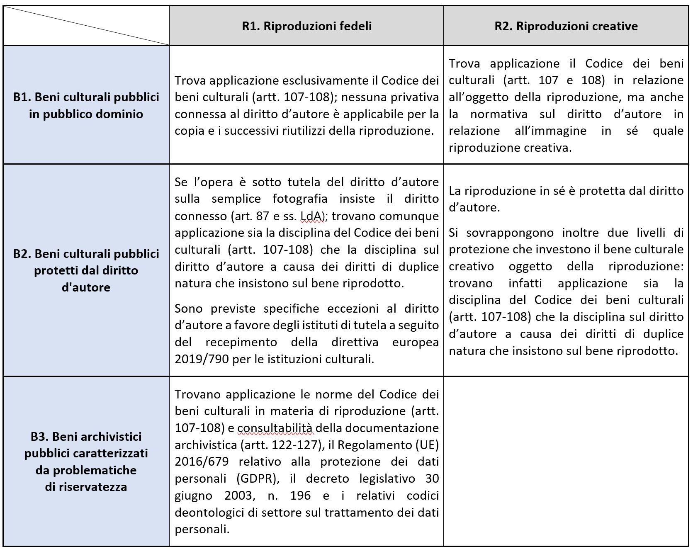

Tipologie di beni culturali in relazione alla tipologia di riproduzione
=======================================================================

Sui beni culturali oggetto di digitalizzazione hanno rilievo diritti di
diversa natura (tutela pubblicistica, tutela del diritto d’autore,
tutela della riservatezza), i quali sono da porre in relazione alle due
principali tipologie di riproduzione sul piano del diritto d’autore
(riproduzione fedele e creativa del bene culturale).

Di seguito vengono analizzate tali componenti, incrociandole tra loro.
In particolare con “\ **B1**-**B3**\ ” si indica lo status dei diritti
sui **B**\ eni culturali da riprodurre e con “\ **R1**-**R2**\ ” le
tipologie di **R**\ iproduzione. Si rinvia infine al quadro di sintesi
riportato in fondo al presente paragrafo.

.. _B1:

B1. Beni culturali pubblici in pubblico dominio
-----------------------------------------------

Sui *beni culturali in pubblico dominio*\  [15]_ (**B1**) non gravano per
definizione privative di tutela del diritto d’autore. Le riproduzioni in
questo caso soggiacciono esclusivamente al Codice dei beni culturali e,
eventualmente, alle norme sulla tutela della riservatezza (cfr. :ref:`B3`).

Le *riproduzioni fedeli* o *mere riproduzioni* (**R1**), prive di
carattere creativo, di beni culturali non protetti da diritto d’autore
costituiscono la stragrande maggioranza delle attuali fattispecie
nell’ambito degli istituti di tutela ministeriali e, per questa ragione,
anche l’oggetto principale del presente documento. Il semplice atto di
digitalizzazione (la conversione di un dato da analogico a digitale) di
un documento d’archivio, di un dipinto, di un’opera architettonica o
scultorea richiede certamente il possesso di competenze tecniche
qualificate da parte dell’operatore ma non costituisce un apporto
creativo e originale tale da poter prefigurare la costituzione di
un’opera creativa; trova quindi applicazione l’art. 32-\ *quater* della
LdA [16]_, che stabilisce che le riproduzioni fedeli di opere per le
quali siano scaduti i termini della protezione del diritto d’autore non
sono soggette a loro volta al diritto d’autore (cfr. par. :ref:`direttiva_2019_790`). Non
appare dunque più congruente la pratica adottata da molti istituti
culturali di rilasciare in rete le riproduzioni dei beni culturali sotto
© Copyright (tutti i diritti riservati), dal momento che tale dicitura
non solo non è applicativa della disciplina del Codice dei beni
culturali, ma non trova presupposti nemmeno nella LdA; per lo stesso
motivo, si ritengono non applicabili le licenze *Creative Commons* per
la circolazione delle riproduzioni fedeli di beni culturali pubblici in
pubblico dominio, giacché tali licenze agiscono esclusivamente nella
sfera del diritto d’autore e dei diritti connessi (cfr. cap. :ref:`principi_riuso`; par.
:ref:`cosa_sono_le_licenze`).

Le *riproduzioni creative* (**R2**) di beni culturali sono invece
riproduzioni alle quali l’autore è riuscito a imprimere un livello di
creatività tale da renderle meritevoli di tutela sotto il profilo della
disciplina del diritto d’autore. Spetta all’autore dell’opera il diritto
di sfruttamento economico dell’opera, che si qualifica – tra gli altri
aspetti - come il diritto esclusivo di “moltiplicazione in copie diretta
o indiretta, temporanea o permanente, in tutto o in parte dell’opera, in
qualunque modo o forma, come la copiatura a mano, la stampa, la
litografia, l’incisione, la fotografia, la fonografia, la cinematografia
e ogni altro procedimento di riproduzione” (LdA, art. 13).

Nella *riproduzione creativa* (**R2**) di un *bene culturale pubblico
in pubblico dominio* (**B1**) è necessario dunque far riferimento a due
diverse normative: da un lato quella riferita all’autore dell’opera
fotografica, dall’altro quella riferita al bene culturale pubblico
oggetto di riproduzione ai sensi dell’art. 108 del Codice dei beni
culturali. È questo il caso, ad esempio, del concorso fotografico
annuale promosso da Wikimedia Italia e denominato “Wiki Loves
Monuments” [17]_, in occasione del quale fotografi professionisti e
dilettanti ritraggono i monumenti italiani alimentando una banca dati di
immagini online a disposizione per il riuso. Il fatto che i fotografi
pubblichino le immagini con licenza aperta (nella fattispecie CC BY-SA),
consentendo quindi anche ad altri di sfruttare economicamente l’opera
fotografica di cui sono autori, non implica il venir meno della
disciplina del Codice dei beni culturali. Quindi, in tutti i casi in cui
le immagini siano sfruttate economicamente, dal fotografo stesso o da
terzi, si applicano i corrispettivi di riproduzione del Codice. È quindi
opportuno in questi casi procedere preliminarmente alla stipula di
chiari accordi tra il fotografo/artista e il luogo della cultura che ha
in consegna il bene al fine di disciplinare la gestione dei diritti di
sfruttamento economico dell’opera creativa e degli eventuali
corrispettivi previsti dal Codice dei beni culturali in presenza di
forme di riutilizzo commerciale delle riproduzioni del bene.

Le fotografie realizzate da professionisti dei beni culturali che
documentano lo svolgimento di attività di tutela (ricognizioni
paesaggistiche, campagne di documentazione scavi archeologici, ecc.)
quali “immagini di persone o di aspetti, elementi o fatti della vita
naturale e sociale, ottenute col processo fotografico o con processo
analogo” rientrano nel novero delle “fotografie semplici” (LdA, art.
87), come tali tutelabili esclusivamente a livello di diritti connessi
fino a vent’anni dalla data dello scatto. Pertanto, particolarmente in
questa fattispecie è necessario prestare attenzione nel momento della
contrattualizzazione con il fotografo, o con il soggetto che ha
commissionato la documentazione, in modo che siano regolate le
condizioni di uso e riuso delle immagini consegnate all’amministrazione.

Un’ultima considerazione riguarda la fotografia di documentazione del
patrimonio culturale, visto nella sua componente sia materiale sia
immateriale (legata agli usi, costumi e tradizioni popolari) che si
sviluppa gradualmente in Italia nel corso della seconda metà del XIX
secolo. Essa si afferma come attività professionale a iniziativa
originariamente privata in un’epoca in cui la distinzione teorica tra
documentazione del patrimonio e pratica artistica appariva più sfumata
rispetto a oggi. Gli esiti di tali campagne fotografiche possono essere
oggi considerati fuori dall’ambito del diritto d’autore e dei diritti
connessi per il decorso dei termini di protezione autoriale, ma anche
fuori dalla disciplina del Codice dei beni culturali. Poiché la
richiesta di corrispettivi per la riproduzione di monumenti e oggetti
d’arte per fini commerciali venne introdotta per la prima volta
nell’ordinamento giuridico nel 1902, per effetto dell’entrata in vigore
della legge 12 giugno 1902, n. 185 (cd. legge Nasi) [18]_, le fotografie
realizzate prima di tale anno possono infatti essere considerate
estranee alla disciplina codicistica per quanto attiene la riproduzione
del monumento (cfr. par. :ref:`codice_dei_beni_culturali`), mentre vi rientrano a pieno titolo se le
medesime fotografie, materialmente intese, sono, in quanto tali, beni
culturali pubblici.

.. _B2:

B2. Beni culturali pubblici protetti da diritto d’autore
---------------------------------------------------------

Nel caso di *beni culturali protetti dal diritto d’autore* (**B2**),
qualsiasi attività di digitalizzazione di opere detenute negli istituti
culturali dovrà essere preventivamente concordata con i titolari dei
diritti di sfruttamento economico delle opere medesime. Tuttavia, come
anticipato nel par. 2.3, per gli istituti culturali esistono sia alcune
importanti eccezioni introdotte dalla direttiva europea 2019/790
(“Copyright”) che legittimano la riproduzione digitale delle opere per
finalità di conservazione [19]_, sia misure che facilitano la
pubblicazione in rete di riproduzioni di opere fuori commercio [20]_
presenti in modo permanente nelle raccolte degli istituti culturali. In
particolare, se l’opera di proprietà dell’istituto risulta fuori
commercio da almeno dieci anni può essere digitalizzata e la sua
immagine può essere pubblicata in rete, per fini non commerciali, previo
accordo di licenza con le relative società di gestione collettiva dei
diritti d'autore [21]_.

Qualsiasi *riproduzione fedele* (**R1**) - vale a dire non creativa - di
un bene culturale pubblico protetto da diritto d’autore dovrà essere
autorizzata espressamente dal titolare dei diritti, il quale a sua volta
dovrà autorizzare qualsiasi ulteriore riproduzione della fotografia
realizzata [22]_. Tale autorizzazione è necessaria anche se il MiC sia
divenuto proprietario o depositario del bene, a meno che l’avente
diritto non abbia stabilito diversamente nell’atto di disposizione
(compravendita o donazione; deposito o prestito). Il bene ancora sotto
diritto d’autore può comunque essere riprodotto dall’istituto di tutela
se si qualifica come opera fuori commercio, ma anche per finalità di
conservazione in base alle eccezioni recepite nella LdA a seguito
dell‘implementazione della direttiva 2019/790 (cfr. par. :ref:`direttiva_2019_790`). La LdA
prevede anche eccezioni (art. 70) quali la possibilità di effettuare il
riassunto, la citazione o la riproduzione di brani o di parti di opera e
la loro comunicazione al pubblico per uso di critica o di discussione;
se effettuati a fini di insegnamento o di ricerca scientifica l'utilizzo
deve inoltre avvenire per finalità illustrative e per fini non
commerciali. Nell’ipotesi infine in cui la riproduzione dell‘opera
protetta dovesse essere riutilizzata a scopi commerciali,
all’autorizzazione dell’autore dovrà aggiungersi l’autorizzazione
dell’ente pubblico proprietario del bene culturale pubblico per effetto
della disciplina del Codice dei beni culturali.

Nella *riproduzione creativa* (**R2**) di un bene culturale protetto dal
diritto d’autore è necessario, infine, tener conto di tre diversi
profili giuridici, che andranno regolati da aspecifici accordi: i
diritti dell’autore dell’opera, i diritti dell’autore delle riproduzioni
e la disciplina del Codice dei beni culturali.

.. _B3:

B3. Beni archivistici pubblici caratterizzati da problematiche di riservatezza
-------------------------------------------------------------------------------

Il rapporto problematico tra riproduzione digitale e tutela della
riservatezza è particolarmente evidente nel caso dei beni archivistici.
Com’è noto la consultabilità della documentazione archivistica è
regolata dagli artt. 122-127 del Codice dei beni culturali, mentre le
categorie di dati personali che meritano speciale protezione sotto il
profilo della riservatezza sono definite dal Regolamento (UE) 2016/679
relativo alla protezione dei dati personali (GDPR). I documenti
conservati negli archivi di Stato sono liberamente accessibili fatta
eccezione per i seguenti documenti:

-  atti relativi alla politica interna ed estera dello Stato, dichiarati
   di carattere riservato dal Ministero dell’Interno d’intesa con il
   MiC, che diventano consultabili 50 anni dopo la loro data;

-  documenti contenenti dati personali che rivelino l’origine razziale o
   etnica, le opinioni politiche, le convinzioni religiose o
   filosofiche, o l’appartenenza sindacale, nonché trattare dati
   genetici, dati biometrici intesi a identificare in modo univoco una
   persona fisica, che diventano consultabili 40 anni dopo la loro data;

-  documenti contenenti dati personali idonei a rivelare lo stato di
   salute, la vita sessuale o i rapporti riservati di tipo familiare,
   che diventano consultabili 70 anni dopo la loro data;

-  documenti contenenti dati relativi a condanne penali, reati e
   connesse misure di sicurezza, che diventano consultabili 40 anni dopo
   la loro data.

Il Ministero dell’Interno può, tuttavia, autorizzare la consultazione
per scopi storici di documenti di carattere riservato conservati negli
archivi di Stato anche prima della scadenza dei termini sopra indicati,
fermo restando che i documenti per i quali è autorizzata la
consultazione anticipata conservano il loro carattere riservato e non
possono essere ulteriormente utilizzati da altri soggetti senza la
relativa autorizzazione (Codice dei beni culturali, art. 123).

Il decreto legislativo 30 giugno 2003, n. 196 (Codice in materia di
protezione dei dati personali) distingue, infatti, fra “comunicazione” e
“diffusione” dei dati personali (art. 2-\ *ter*). Restano in capo al
soggetto conservatore le responsabilità derivanti da eventuali
violazioni della norma rispetto alla “comunicazione” dei documenti
contenenti dati personali. Ciò può verificarsi nel caso in cui non siano
rispettati i termini di consultabilità della documentazione previsti
dall’art. 122 del Codice dei beni culturali.

Per “diffusione” si intende la pubblicazione, o comunque una
condivisione indiscriminata nei confronti di una comunità di utenti
indeterminata e ampia. La diffusione dei dati personali, anche a mezzo
di riproduzione, non è permessa a meno che essa non rientri in una delle
eccezioni previste dal Regolamento (UE) 2016/679 e dagli altri atti
normativi di livello nazionale coordinati, quali il decreto legislativo
n. 196/2003 e le Regole deontologiche ad esso allegate, che definiscono
criteri di valutazione per la diffusione di documenti contenenti dati
personali in base all’ambito o disciplina in cui si trova l’utente si
trova ad operare [23]_. Questo tipo di attività è precisamente normato
dalle Regole deontologiche che suggeriscono anche quali siano gli
strumenti da utilizzare e i criteri da seguire.

Le responsabilità correlate a una diffusione illegittima di dati
personali stanno in capo all’autore della diffusione individuabile, di
norma, nell’utente o in qualunque altro soggetto sia venuto in possesso,
a qualsiasi titolo e in qualunque momento, della riproduzione effettuata
dall’utente medesimo. Occorre però considerare che in alcuni casi può
essere il soggetto conservatore a farsi promotore della diffusione dei
documenti e ad essere quindi responsabile di eventuali violazioni di
dati (*data breach*). La responsabilità in capo all’utente non esime in
ogni caso l’istituto di tutela dall’assumere ogni accortezza e misura
atta a prevenire a monte l’accesso da parte del pubblico a serie
archivistiche o fondi che potrebbero, presumibilmente, contenere dati
personali. In questi casi è infatti l’accesso, prima ancora che la
riproduzione stessa, a dover essere preventivamente regolato.

La riproduzione con mezzo proprio della documentazione liberamente
consultabile nelle sale di studio degli archivi di Stato è disciplinata
dalla circolare n. 33/2017 della Direzione Generale Archivi, la quale
detta prescrizioni anche in merito alla riproducibilità della
documentazione riservata. In questo caso la riproduzione può essere
effettuata, su richiesta degli interessati, esclusivamente a cura
dell’istituto, il quale può non autorizzare la riproduzione qualora la
documentazione contenga “categorie particolari di dati personali” o
“dati personali relativi a condanne penali e reati” di cui agli artt.
9-10 del GDPR [24]_.

Qualora la documentazione archivistica sia oggetto di progetti di
digitalizzazione intrapresi da soggetti pubblici o privati sarà
necessario adottare ogni accortezza per tutelare la riservatezza del
titolare del dato esaminando accuratamente la documentazione da
riprodurre al fine di regolamentarne la fruizione in rete anche nel caso
in cui la documentazione risulti liberamente consultabile ai sensi del
Codice dei beni culturali. Le regole deontologiche per il trattamento a
fini di archiviazione nel pubblico interesse o per scopi di ricerca
storica sono fondate sul principio che i dati personali debbono essere
utilizzati nel rispetto della dignità delle persone interessate. Da
questo principio, discende una serie di norme di comportamento che
vincolano sia gli archivisti che l’utenza degli archivi e che vanno
osservate non solo in riferimento ai documenti dell’ultimo settantennio,
ma anche a quelli di data anteriore, nel caso in cui contengano dati
personali la cui divulgazione può ledere la dignità di persone viventi.

Pertanto, nell’eventualità in cui dall’esame della documentazione da
digitalizzare possano emergere problemi di riservatezza tali da
costituire una potenziale minaccia alla tutela della dignità di
individui potrà essere utile elaborare un adeguato sistema di
metadatazione delle riproduzioni per governare le modalità di accesso
alla documentazione da remoto. La regolamentazione degli accessi potrà
fare capo a un sistema di registrazione online dell’utenza mediante SPID
che sia in grado di riconoscere con certezza l’identità del richiedente
e di informarlo adeguatamente in merito al contenuto delle regole
deontologiche per il trattamento dei dati e dunque alle responsabilità
derivanti da un utilizzo illegittimo di dati personali altrui.

Quadro sinottico (B-Beni culturali/R-Tipi di Riproduzione)
----------------------------------------------------------

L’incrocio delle casistiche sopra analizzate può essere riassunto nella
matrice che segue:

|image0|

.. [15] Opere non più coperte da diritto d'autore per esplicita rinuncia da
   parte dei titolari dei diritti oppure per scadenza dei termini
   temporali previsti dalla LdA.

.. [16] LdA, art. 32-\ \ *quater*: “Alla scadenza della durata di protezione
   di un'opera delle arti visive, anche come individuate all'articolo 2,
   il materiale derivante da un atto di riproduzione di tale opera non è
   soggetto al diritto d'autore o a diritti connessi, salvo che
   costituisca un'opera originale. Restano ferme le disposizioni in
   materia di riproduzione dei beni culturali di cui al decreto d.lgs.
   42/2004”.

.. [17] Wiki loves monuments: https://www.wikimedia.it/wiki-loves-monuments/

.. [18] ”La riproduzione dei monumenti e degli oggetti d'arte e di antichità
   di proprietà governativa sarà permessa con le norme e alle condizioni
   da stabilirsi nel Regolamento e verso il pagamento di un adeguato
   compenso“ (art. 19). Cfr. in proposito il regio decreto 28 giugno
   1906, n. 447 che modifica il Capo V (*Delle riproduzioni di oggetti
   di antichità e d’arte*), Sez. III (*Riproduzioni fotografiche*) del
   regolamento 17 luglio 1904, n. 431 riguardante la conservazione dei
   monumenti e degli oggetti d’antichità e d’arte (artt. 32-40). Nelle
   norme e nei regolamenti precedenti la riproduzione di monumenti per
   uso commerciale non era vincolata alla corresponsione di un
   corrispettivo economico da parte del fotografo.

.. [19] L’eccezione a favore della conservazione, attraverso l’art. 1, comma
   1, lettera g) del d.lgs. 177/2021, è stata trasposta all’art. 68,
   comma 2-\ \ *bis* della LdA nei termini seguenti: ”2-\ \ *bis*. Gli
   istituti di tutela del patrimonio culturale di cui all'articolo
   70-\ \ *ter*, comma 3, per finalità di conservazione e nella misura a
   tal fine necessaria, hanno sempre il diritto di riprodurre e
   realizzare copie di opere o di altri materiali protetti, presenti in
   modo permanente nelle loro raccolte, in qualsiasi formato e su
   qualsiasi supporto. È nulla qualsiasi pattuizione avente ad oggetto
   limitazioni o esclusioni di tale diritto”.

.. [20] L’eccezione relativa alle opere fuori commercio, attraverso l’art.
   1, comma 1, lettera o) del d.lgs. 177/2021, è stata trasposta agli
   artt. 102-\ \ *undecies*-102-*septiesdecies* della LdA.

.. [21] “Con decreto del Ministro della cultura possono essere individuati
   ulteriori requisiti specifici ai fini della definizione delle opere
   fuori commercio, previa consultazione con i titolari dei diritti, gli
   organismi di gestione collettiva e gli istituti di tutela del
   patrimonio culturale” (LdA, art. 102-\ \ *undecies*).

.. [22] Sulla riproduzione fedele dell’opera sotto tutela del diritto
   d’autore insiste anche il diritto connesso del fotografo di cui
   all’art. 87 e ss. LdA, a meno che la riproduzione non venga
   realizzata dall’istituto di tutela stesso. Se la fotografia è stata
   commissionata i diritti di sfruttamento economico spettano al
   committente, salvo patto contrario. Per gli utilizzi commerciali
   successivi è comunque previsto un equo corrispettivo a favore del
   fotografo. Su questi aspetti cfr. anche ICOM Italia, `FAQ diritto
   d’autore, copyright e licenze aperte per la cultura nel
   web <https://digitallibrary.cultura.gov.it/wp-content/uploads/2021/04/FAQ-DIRITTO-DAUTORE-COPYRIGHT-E-LICENZE-APERTE-PER-LA-CULTURA-NEL-WEB-10_03_2021-1.pdf>`__
   (11/03/2021).

.. [23] Si segnalano in particolare le Regole deontologiche per trattamenti
   a fini statistici o di ricerca scientifica, le Regole deontologiche
   relative al trattamento dei dati personali nell'esercizio
   dell'attività giornalistica e, soprattutto, le Regole deontologiche
   per il trattamento a fini di archiviazione nel pubblico interesse o
   per scopi di ricerca storica pubblicate ai sensi dell’art. 20, comma
   4, del decreto legislativo 10 agosto 2018, n. 101
   (https://www.garanteprivacy.it/home/docweb/-/docweb-display/docweb/9069661).

.. [24] A seguito dell’abrogazione dell’art. 22 ad opera del d.lgs. 101/2018
   il riferimento ai dati sensibili e giudiziari e sulla salute (cd.
   dati sensibilissimi o supersensibili) presente nella circolare n.
   33/2017 della Direzione generale Archivi va ora messo in relazione
   alle “categorie particolari di dati personali” e ai “dati personali
   relativi a condanne penali e reati” definite agli artt. 9 -10 del
   GDPR.

